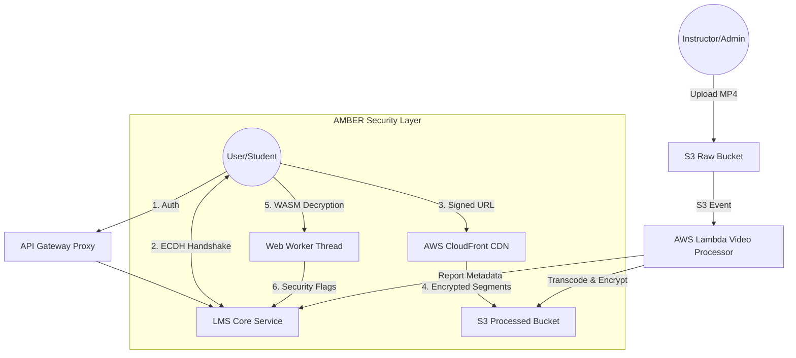

# AES-128 LMS: Pro Level Serverless Learning Management System

[](https://nextjs.org/)
[](https://aws.amazon.com/)
[](https://www.docker.com/)
[](https://www.prisma.io/)

A high-performance, secure, and scalable Learning Management System (LMS) built with a focus on premium content protection and seamless user experience. This project demonstrates advanced cloud engineering skills, featuring a custom **AES-128 HLS encryption** pipeline, **Serverless Video Processing**, and a robust **Microservices Architecture**.

---

## 🏗️ Architecture Overview

The system is designed as a hybrid-cloud environment, leveraging the best of VPS for core services and AWS for heavy lifting.



---

To deter unauthorized downloading and redistribution, the system implements a production-grade 
**content protection architecture (DRM-inspired, cost-efficient alternative)**:

1.  **ECDH Handshake**: Uses **Elliptic Curve Diffie-Hellman** to establish a session-specific shared secret. The actual AES key is never sent over the wire in plain text; it is encrypted using this ephemeral secret, making network capture impossible.
2.  **AssemblyScript WASM Protection**: Core key derivation logic is compiled into a binary **WebAssembly (WASM)** module. This provides an opaque execution layer that **raises the barrier against casual reverse-engineering** and DevTools inspection.
3.  **HLS Segment Encryption**: Individual `.ts` segments are encrypted using AES-CBC and decrypted on-the-fly in a **Worker Thread**.
4.  **Dynamic Watermarking**: Injects the student's email as a moving, semi-transparent overlay. It shifts positions every 45 seconds, **deterring screen recording and enabling forensic tracing of leaks**.
5.  **Behavioral Analysis**: The worker monitors fetching patterns. If a mass download attempt is detected (Rapid Fetching), it silenly flags the user account.

### Secured Content Delivery & Monitoring
-   **Multi-IP Tracking**: Every student session logs unique IP addresses and user agents to identify and flag potential account sharing.
-   **Security Admin Console**: Real-time visibility into flagged users, rapid download attempts, and access history via the Admin Dashboard.
-   **Signed URLs**: Video segments are served via CloudFront Signed URLs with time-bound credentials.

---

## 🚀 Key Features

-   **Next.js 16 Frontend**: A premium, sharp-edged (cube-like) UI built for speed and SEO.
-   **AMBER Handshake**: Per-session ECDH key exchange to prevent key extraction.
-   **WASM Decryption**: Hardened binary decryption layer for maximum protection.
-   **Anti-Piracy Dashboard**: Real-time flagging of mass-download attempts and account sharing.
-   **Microservices Backend**: Decoupled services for LMS logic, Student management, and Authentication.
-   **HLS Video Player**: Custom-built player with manual AES decryption for maximum security.
-   **Razorpay Integration**: Seamless payment processing for course enrollments.
-   **Dockerized Deployment**: Fully containerized services with CI/CD via GitHub Actions and GHCR.
-   **Global CDN**: Low-latency content delivery via AWS CloudFront.

---

## 🛠️ Tech Stack

-   **Frontend**: Next.js, TypeScript, HLS.js, Web Workers, TailwindCSS (for layout).
-   **Backend**: Node.js/Express (Microservices), API Gateway Proxy.
-   **Database**: PostgreSQL (Neon Serverless) with Prisma ORM.
-   **Infrastructure**: 
    -   **AWS Lambda**: Serverless video transcoding and encryption.
    -   **AWS S3**: Secure object storage (Raw & Processed).
    -   **AWS CloudFront**: Edge-optimized content delivery.
    -   **Docker & Docker Compose**: Orchestration and local development.
-   **CI/CD**: GitHub Actions, appleboy/ssh-action (VPS Deployment), GHCR.

---

## 📖 Getting Started

1.  **Clone the Repository**:
    ```bash
    git clone https://github.com/Amber-bisht/aes128-lms-admin-lambda-nextjs.git
    ```
2.  **Environment Setup**:
    Copy `.env.example` to `.env` and fill in your AWS credentials, Database URL, and JWT secrets.
3.  **Local Development**:
    ```bash
    docker compose up -d
    # or
    npm install && npm run dev
    ```

---

Developed by [Amber Bisht](https://github.com/Amber-bisht)
