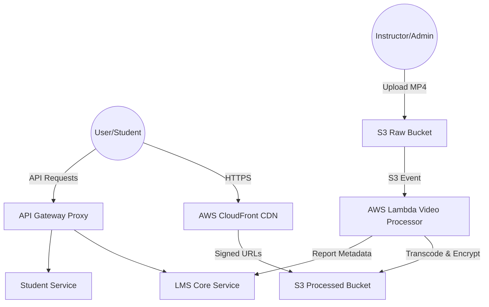

# AES-128 LMS: Enterprise-Grade Serverless Learning Management System

[](https://nextjs.org/)
[](https://aws.amazon.com/)
[](https://www.docker.com/)
[](https://www.prisma.io/)

A high-performance, secure, and scalable Learning Management System (LMS) built with a focus on premium content protection and seamless user experience. This project demonstrates advanced cloud engineering skills, featuring a custom **AES-128 HLS encryption** pipeline, **Serverless Video Processing**, and a robust **Microservices Architecture**.

---

## 🏗️ Architecture Overview

The system is designed as a hybrid-cloud environment, leveraging the best of VPS for core services and AWS for heavy lifting.



---

## 🔒 Security & Content Protection

### AES-128 bit Encryption (Serverless)
To prevent unauthorized downloading and redistribution of premium course content, the system implements a state-of-the-art encryption flow:

1.  **Serverless Processing**: Upon upload, an **AWS Lambda** function pulls the raw video and uses **FFmpeg** to transcode it into HLS (HTTP Live Streaming) segments.
2.  **Unique Keys**: Every video is encrypted with a unique **16-byte random AES-128 key** and IV (Initialization Vector).
3.  **HLS Segment Encryption**: Individual `.ts` segments are encrypted using AES-CBC.
4.  **Web Worker Decryption**: The Next.js frontend utilizes a custom `hls.js` loader that offloads decryption logic to a **Web Worker**, ensuring smooth playback without blocking the main UI thread.

### Secured Content Delivery
-   **2-Bucket S3 Model**: Separation of concerns between `Raw` (input) and `Processed` (output) buckets. Both buckets are private and not accessible via public URLs.
-   **AWS CloudFront CDN**: Content is delivered globally through CloudFront.
-   **Signed URLs**: Video segments are served via CloudFront Signed URLs, ensuring that only authenticated students with active enrollments can access the HLS stream.

---

## 🚀 Key Features

-   **Next.js 16 Frontend**: A premium, sharp-edged (cube-like) UI built for speed and SEO.
-   **Microservices Backend**: Decoupled services for LMS logic, Student management, and Authentication.
-   **HLS Video Player**: Custom-built player with manual AES decryption for maximum security.
-   **Razorpay Integration**: Seamless payment processing for course enrollments.
-   **Dockerized Deployment**: Fully containerized services with CI/CD via GitHub Actions and GHCR.
-   **Global CDN**: Low-latency content delivery via AWS CloudFront.

---

## 🛠️ Tech Stack

-   **Frontend**: Next.js, TypeScript, HLS.js, Web Workers, TailwindCSS (for layout).
-   **Backend**: Node.js/Express (Microservices), API Gateway Proxy.
-   **Database**: PostgreSQL (Neon Serverless) with Prisma ORM.
-   **Infrastructure**: 
    -   **AWS Lambda**: Serverless video transcoding and encryption.
    -   **AWS S3**: Secure object storage (Raw & Processed).
    -   **AWS CloudFront**: Edge-optimized content delivery.
    -   **Docker & Docker Compose**: Orchestration and local development.
-   **CI/CD**: GitHub Actions, appleboy/ssh-action (VPS Deployment), GHCR.

---

## 📖 Getting Started

1.  **Clone the Repository**:
    ```bash
    git clone https://github.com/Amber-bisht/aes128-lms-admin-lambda-nextjs.git
    ```
2.  **Environment Setup**:
    Copy `.env.example` to `.env` and fill in your AWS credentials, Database URL, and JWT secrets.
3.  **Local Development**:
    ```bash
    docker compose up -d
    # or
    npm install && npm run dev
    ```

---

Developed with ❤️ by [Amber Bisht](https://github.com/Amber-bisht)
